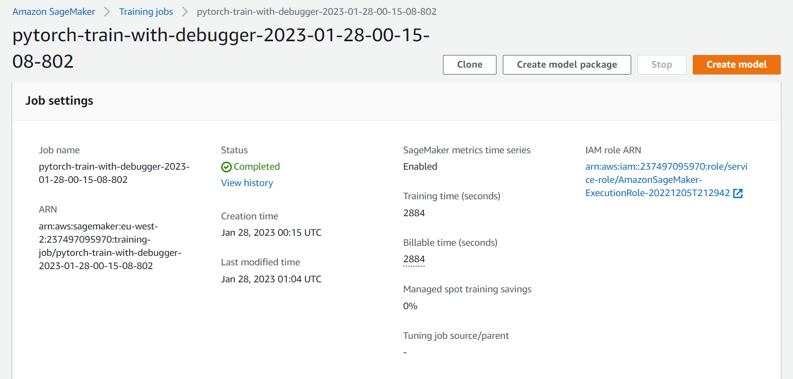

# Inventory Monitoring at a Distribution Centre

## Domain Overview
Traditional supply chain models focus on storing large quantities of product across different location, which is heavily relied on manual processes.
Modern supply chain models focus on having the right quantity of product , available at right time at the right place. 

## Problem Statement
Manual processes in traditional supply chain models may lead to low efficiency and waste of resources, such as employ time and machine cost.

## Solution Statement
In distribution centres, robots are often used to move objects as part of their operations. Bins size and the number of objects in each bin differs, thus delivery of correct consignments can be challenging. To complete the task efficiently, machine leaning could be utilized to predict the number of items in each bin. 
The machine learning model will be based on a pre-trained convolutional neural network, such as resnet 50. Then, it will be tuned on a few selected hyper parameters to improve model performance, for example, learning rate, batch size and number of epochs. Furthermore, model performance assessment will be based on a few selected metrics, that are suitable to this use case, such as cross entropy loss.

## Dataset and Inputs
The publicly available Amazon Bin Image Dataset will be used in this project. This dataset contains over 500,000 images, where each image contains one or more objects. In addition, the dataset contains JSM metadata from bins of a pod in an operating Amazon Fulfilment Centre, such as number of objects, it’s dimension and the type of object. Given the dataset, the task is to classify the number of objects in each bin.

Example of an image from the dataset

## Project Design

The pipeline of the project is designed as the following steps:

1.	Download the data and upload to S3 bucket

2.	Complete multi-instance Hyperparameter tuning

3.	Model profiling and debugging

4.  Model Performance

6.	Endpoint deployment and Lambda quering

## Upload Data to S3

## Multi-instance Hyper Parameter Tuning

Parameters and range seleted:

1. "learning_rate": (0.001, 0.1)

2. "batch_size": [32, 64, 128, 256, 512]

### Training Job Completed

### Check Best Hyper Parameters

## Model Profiling and Degugging

### Training Job with Debugger Completed

## Model Performance

Model performance shows a steady decrease of both training and validation cross entropy loss
## Model Deploying and Querying

### Endpoint Deployed

### Lambda Test Result

### All 3 sample images are predicted successfully

